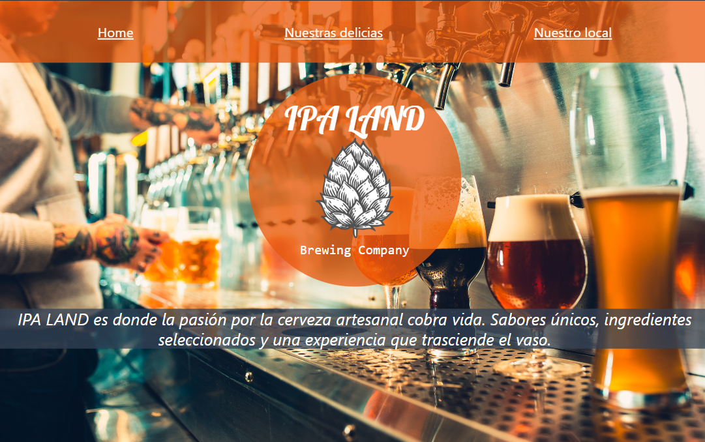
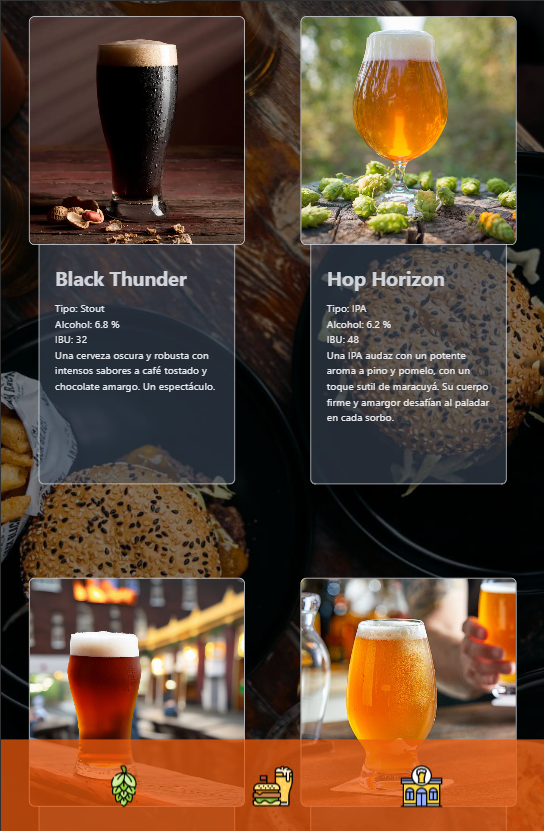
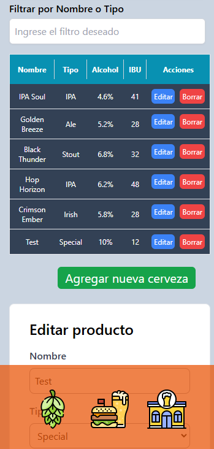

# Ipa Land - Cervecería 🍻

**Ipa Land** es una aplicación web que permite visualizar y administrar diferentes tipos de cervezas. El proyecto está compuesto por un frontend en **Angular** con **Tailwind CSS** para los estilos, y un backend construido con **Node.js** y **Express**, conectado a una base de datos **MongoDB**. 

## Funcionalidades 🔧

### Frontend 🎨
- **Visualización de menú**: El sitio carga una lista de cervezas con sus características (nombre, tipo, alcohol, IBU, imagen, descripción).
- **Panel de administración**: Los administradores pueden agregar, editar y eliminar cervezas en el menú mediante un panel protegido con autenticación básica.
- **Responsividad**: El diseño está optimizado para dispositivos móviles utilizando **Tailwind CSS**.

### Backend ⚙
- **API RESTful**: El servidor expone una API para realizar operaciones CRUD sobre las cervezas. Desplegado en **Render**.
- **Autenticación**: Los administradores deben proporcionar un usuario y una contraseña para acceder al CRUD.
- **MongoDB**: Los datos de las cervezas se almacenan en una base de datos MongoDB, utilizando Mongoose.

## Acceso al Panel de Administración 🔑

Para acceder al panel de administración, dirígete manualmente a la ruta `/login`. 

- **Usuario**: ~~admin~~
- **Contraseña**: ~~123456~~

## Imágenes 📸

  

  

  

## Contacto 📩
No dudes en contactarme ante cualquier consulta o sugerencia 👋🏻. Tomar con moderación 🍺.